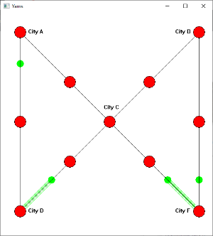

# Yams-Threads

## Условие задачи
Многопоточная Windows программа модель ямской связи
между 11 почтовыми станциями в старой Российской империи. Разработать
программную модель ямской почтовой связи, имевшейся в Российской империи.
Модель представляет 11 почтовых станций, между которыми перемещаются
почтовые подводы. За каждой почтовой стацией закреплено некоторое число
лошадей. Это количество может быть не полностью готовым для перевозок
(лошади отдыхают после гоньбы), промоделировать случайными величинами. На
пяти ведущих станциях, моделирующих города, случайным образом формируются
лица, едущие по казенной надобности, случайным образом в один из городов,
которые представляются станциями. Изображение городов – в центре окна и по его
углам, дороги по периметру окна и диагоналям. Подобрать характеристики
программных генераторов ездоков, чтобы на станциях возникали ситуации
ожидания освоившихся или отдохнувших лошадей. Для упрощения модели в
подводу для путешественника впрягается одна лошадь. Поведение каждого
пассажира и подводы должно реализоваться отдельной нитью. Для правильного
взаимодействия использовать семафоры или мьютексы.

## Что получилось

## Отчет
Результат работы находится рядом с проектов в формате .pdf
